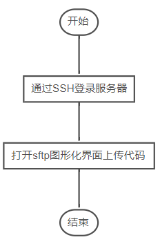
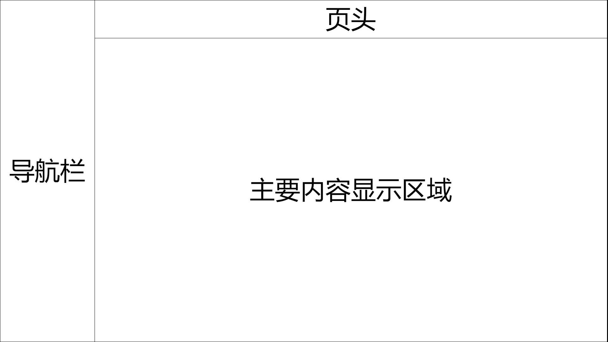
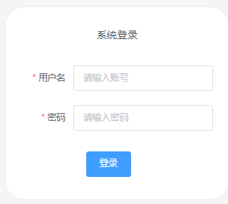
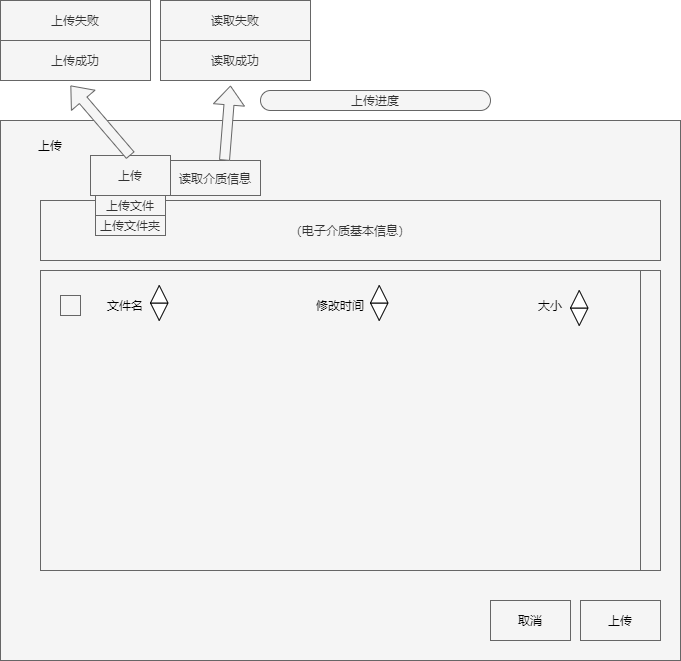
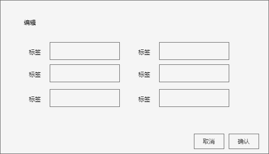
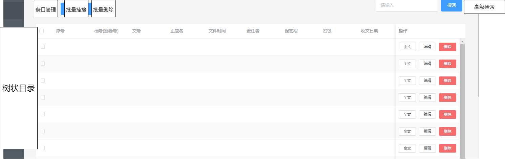
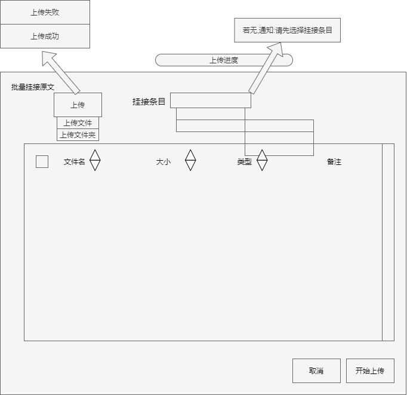
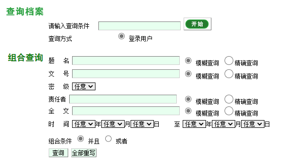

# 设计方案

## 整体方案

设计一个主要用于管理电子介质的信息管理系统，兼顾管理档案数据的信息管理系统。主要以帮助档案工作者们简化工作任务，提高工作效率以及解决电子档案安全性问题为目的，是一个面向档案信息处理，并集电子档案自动流转、电子档案长期保存、电子档案的自动整编以及档案信息利用和安全模块为一体的资源平台。系统的模块设计充分参考了实体档案管理工作中的流程和规范。


### 项目搭建

使用Vue+VueX+VueRouter+axios+elementUI+nodejs进行项目搭建

### 部署方案

部署简单来说就是将构建产出的代码部署到服务器上。假设我们的前端项目和后端项目已经开发完成了，前端是在我们自己的本地服务器开发的，后端也会在自己的服务器上开发完成，每开发到一个大阶段，或者是开发到最后，我们都需要将项目部署到外网服务器上（上线），至于如何部署我们的服务器，各个服务器都会启动什么服务，承载什么内容，服务器之间有什么关系这些都属于服务器部署。

部署一般有这两种部署方案：

* 前后端不分离 (前后端耦合)
* 前后端分离

本次项目使用的部署方案是**前后端不分离部署**，接下来将介绍这两种部署方案。

#### 前后端不分离部署

前后端不分离，指的就是前端开发的所有代码及资源（dist）会直接放入到后端开发的服务器中，此时，client访问的时候所有的资源（html等）都交由的node提供，而数据请求都交由node提供

前后端不分离，back-end不仅提供数据请求还提供资源请求

客户端的请求一般分为两种：资源请求，数据请求

目前比较流行的webserver主要有两种： apache，nginx

#### 前后端分离部署

一个服务器提供资源，一个服务器提供数据

例如：百度，将api接口资源和html文件资源放在了www.baidu.com服务器，而其他的css，js，image等资源放在了多个资源服务器上，也就是说百度将自己的代码部署在两种服务器上，一种后端服务器提供api接口和html页面，一种是前端服务器提供js逻辑，css样式等资源...

#### 两种部署方案的优缺点及适用场景

前后端不分离部署适合一些中小企业的中小级项目

如果前端代码有了新的版本，例如js或者css变化，这个适合前端重新打包代码后需要重新交给服务端进行部署

如果我们把服务器分开，一个apiserver，一个staticserver的话，前端有了新的js或者css代码后，只需要将staticserver中的代码进行替换，api server不需要进行重新部署

前后端分离部署的好处就在于无论是前端更新代码版本还是后端更新代码版本只需要在对应的服务器上进行更新就可以了，不需要另一台服务器做什么事情，更新维护更方便，成本更低。

原文链接：https://blog.csdn.net/iiichigo/article/details/83269796
原文链接：https://blog.csdn.net/wang839305939/article/details/82343566

#### 部署步骤

在开发中我们通常的操作就是使用ftp将代码上传到服务器上固定目录下即可。实现步骤如下图所示。



### 监控方案

#### **Web监控。**

web监控的话题其实还是很多。比如可以使用自带的web监控来监控页面相关的延迟、js响应时间、下载时间、等等。这里我推荐使用专业的商业软件,监控宝或听云来实现。毕竟人家全国各地都有机房。（如果本身是多机房那就另说了）

#### 性能监控

全面监控网页性能，DNS响应时间、HTTP建立连接时间、页面性能指数、响应时间、可用率、元素大小等

#### **日志监控。**

如果是web的话可以使用监控Nginx的50x、40x的错误日志，PHP的ERROR日志。其实这些需求无非是，收集、存储、查询、展示，我们其实可以使用开源的ELKstack来实现。Logstash（收集）、elasticsearch（存储+搜索）、kibana（展示）

## 页面设计

此项目的页面设计是单页面设计，单页面设计指的是指一个系统只加载一次资源，然后下面的操作交互、数据交互是通过router、ajax来进行，页面并没有刷新。这一单页面分为三个部分：导航菜单、页头和主要的内容显示区域。如下图所示。



### 登录界面

#### 页面描述

用于信息系统的登录

#### UI & 交互逻辑(UI 拆分)



* 状态

状态是指用来表示当前DOM元素特征的属性

form{username，password}：用户名和密码

rules{}：表单验证规则

```
 rules: {
        username: [
          {
            required: true,
            message: "请输入用户名",
            trigger: "blur",
          },
          {
            minLengthUsername: 3,
            message: "用户名长度不能小于3位",
            trigger: "blur",
          },
        ],
        password: [{ required: true, message: "请输入密码", trigger: "blur" }],
```

login（）：登录按钮

* 请求逻辑

login（）：如果用户名和密码与store吻合，且传递过来的数据code状态码也为20000，则表示传递的数据正确，故清除路由，然后根据用户的权限等级，依照menu数据动态添加路由。

### 导航菜单

#### 页面描述

为网站提供导航功能的垂直菜单，并且会内嵌子菜单。可以导航到首页、电子介质管理、档案管理、用户管理、系统设置，并且使显示区域显示导航到对应的内容。

#### UI & 交互逻辑(UI 拆分)

UI：导航菜单的顶部是整个信息管理系统的标题“华农档案管理系统”，其余标签是提供导航功能的入口。


交互逻辑：点击菜单上的指定标签可以使主要内容显示区域上显示关于这个标签的内容。

* 状态

状态是指用来表示当前DOM元素特征的属性

collapse：是否折叠导航菜单

menu：导航菜单标签数据

```

menu: [
	{
              path: '',  
              name: '',  
              label: '',
              icon: '',
              url: ''
            },

              label: '',
              icon: '',
		//子菜单
              children: [
                {
                  path: '',
                  name: '',
                  label: '',
                  icon: '',
                  url: ''
                },
      ],
```

@open

@close

@click="clickMenu(item)"：控制导航栏标签的路由

* 请求逻辑

collapse属性：是根据页头的“折叠按钮”来改变数据。当页头的“折叠按钮”被按下后，通过提交 mutation方法改变store的state数据，然后通过computed的isCollapse方法获取被修改后的state数据既可获得isCollapse属性的数据。

menu属性：通过computed的asyncMenu方法获得state数据，state数据通过axios来获得后台数据。

* 业务逻辑

点击菜单上的指定标签可以使主要内容显示区域上显示关于这个标签的内容。

### 页头

#### 页面描述

左侧是控制导航菜单是否折叠的按钮，中间使用到elementUI的面包屑组件，即显示当前页面的路径，快速返回之前的任意页面。右侧则是登录后显示的头像。

#### UI & 交互逻辑(UI 拆分)


##### 按钮模块

控制导航菜单是否折叠的按钮

* 状态

@click="handleMenu"方法：修改state的collaspe属性

* 请求逻辑

@click="handleMenu"方法：用于执行state中的collaspeMenu方法，修改state的collaspe属性。

##### 面包屑模块

显示当前页面的路径，快速返回之前的任意页面

* 状态

@click="changeMenu(item)"：点击面包屑标签并且切换页面

@close="handleMenuClose(item, index)"：关闭面包屑标签并且切换页面

tags：面包屑数据

```javascript
tabsList:[//面包屑数据
            {
                path:'/',
                name:'home',
                lable:'首页',
                icon:'home'
            }
        ],
```

* 请求逻辑

@click="changeMenu(item)"：向router路由push面包屑数据中该元素的name属性

@close="handleMenuClose(item, index)"：此处分三种情况，一是如果删除的标签不是该页面，则return；二是如果删除的标签是最后一个标签，则页面切换到该标签index的前一个；三是如果删除的标签不是最后一个标签，则页面切换到该标签index的后一个。

##### 头像模块

该模块是登录后显示的头像。鼠标悬浮在头像可以显示下拉菜单，下拉菜单包括"个人中心"和"退出登录"。

* 状态

userImg：用户头像

@click="goPersonalCenter"：切换到个人中心页面

@click.native="logOut"：退出登录

* 请求逻辑

userImg：通过store的user文件夹的getUserImg方法获得图片路径，getUserImg方法，通过双向绑定输入到src路径。

@click="goPersonalCenter"：router路由push个人中心的name属性

@click.native="logOut"：commit执行store中的clearToken清除state的token属性和remove移除Cookie的token属性。

### 主要内容显示区域

#### 电子介质管理

##### 页面描述

展现电子介质信息表的查看功能，同时提供电子介质数据表的增删查改功能，并且可以识别电脑是否存在的电子介质并且读取电子介质的各种信息。

##### URL

/storageManage

##### UI & 交互逻辑(UI 拆分)


###### 上传按钮

* 状态

isShowUpload：控制上传对话框是否显示

* 逻辑

openUploadStorage()：打开上传对话框。具体实现：isShowUpload设为true

###### 上传对话框

* 上传对话框页面

  
* props

isShowUpload:控制是否显示

uploadFormLabel：上传对话框电子介质信息标签数据表。从父组件的tableData获得。

```
uploadFormLabel: [],

```

* 状态

uploadForm：上传对话框电子介质信息数据表。

```
 uploadForm: {},
```

tableLable：表格标签

```
tableLable:[
                {
                name: "fileName",
                label: "文件名",
                },
                {
                name: "modificationTime",
                label: "修改时间",
                },
                {
                name: "fileSize",
                label: "大小",
                }
            ],
```

tableData：表格数据。从上传的文件中获得数据

```
tableData:[
               {
                model: "fileName",
                label: "文件名",
                },
                {
                model: "modificationTime",
                label: "修改时间",
                },
                {
                model: "fileSize",
                label: "大小",
                }
            ],
```

* 请求逻辑

getTableData()：获得tableData表格数据。从上传文件中获得数据。

uploadFile()：上传文件按钮。若上传成功则显示“上传成功”，否则“上传失败”。

uploadFolder()：上传文件夹按钮。若上传成功则显示“上传成功”，否则“上传失败”。

readStorageData()：读取介质信息按钮。若读取成功则显示“读取成功”，否则“失败”。

comfirm()：确认按钮。确认后开始上传，主页面显示上传进度条。

cancle()：取消按钮。

###### 下载按钮

* 逻辑

downloadStorage()：下载多选框已选定电子介质的文件。具体实现：通过前端传参，后端生成文件的方式下载到客户电视上。1.前端通过发送数据或参数给到后端。2.在由后端根据参数查找出对应的数据在生成文件。3.然后在响应请求头中设置。

```javascript
原文链接：https://blog.csdn.net/RequesToGod/article/details/111629296
```

###### 删除按钮

###### 批量删除按钮

* 逻辑

delStorage()：用于批量删除按钮。删除多选框选中的行电子介质信息，并且询问是否同时删除属于该电子介质的文件。具体实现：

```
原文链接：https://blog.csdn.net/weixin_43185419/article/details/118958541
```

###### 编辑按钮

* 状态

isShowEdit：控制编辑对话框是否显示

* 逻辑

editStorage(row)：用于编辑按钮。isShowEdit设为true，然后row数据是子组件table传过来的行数据,将row数据传入editForm。

###### 编辑对话框

* 编辑对话框页面



* Props

editFormLabel：编辑对话框标签数据表。从tableLabel获得

```
        editFormLabel:Array,

```

editForm：编辑对话框数据表。

```
        editForm:Array,

```

* 交互逻辑

comfirm()：确认按钮。

cancle()：取消按钮。

###### 搜索按钮

* 状态

searchFormLabel：搜索标签表

```javascript
searchFormLabel: [
        {
          model: "keyword",
          label: "",
          type: "input",
        },
      ],
```

searchForm：搜索数据表

```javascript
searchForm: {
        keyword: "",
      },
```

###### 表格

* 状态

tableLabel：数据表格标签

```javascript
 tableLabel: [
        {
          name: "",
          label: "",
          type: "input"
        }
      ],
```

tableData：数据表格。数据是从后端获得的！

```j
      tableData: [
{
          model: "storageID",
          label: "介质编号",
          type: "input",
        },
        {
          model: "type",
          label: "设备类型",
          type: "input",
        },
        {
          model: "manufacturer",
          label: "设备制造商",
          type: "input",
        },
        {
          model: "modelNumber",
          label: "设备型号",
          type: "input",
        },
        {
          model: "lastUploadTime",
          label: "最后上传时间",
          type: "input",
        },
        {
          model: "numberOfDocuments",
          label: "总文件数",
          type: "input",
        },
],

```

multipleSelection: []：存储多选框选中行的介质编号storageID

* 逻辑

getData()：获取电子介质表格数据，包括标签数据。具体实现：1.传入的name是否存在，存在则当前页面设置为1。2.调用接口获取后端数据。3.传入参数

###### 分页

config：分页配置

```javascript

config: {
        page: 1,
        total: 30,
        pageSize: 20,
      }
```

#### 档案管理

##### 页面描述

展现档案管理的查看功能，同时提供档案数据表的增删查改功能。



##### URL

/storageManage

##### UI & 交互逻辑(UI 拆分)

###### 条目管理

* 状态

isItemManage：表示是否正在修改树状目录

* 逻辑

HandleIsItemManage()：第一次点下时，使isItemManage为true，直到在点一次“修改完毕”，则提交数据到后端并且使isItemManage为false，结束修改。

###### 批量挂接按钮

* 状态

isShowUpload：批量挂接页面是否显示。用于表示uploadDialog对话框的显示。

* 逻辑

uploadFile()：使isShowUpload为true

###### 批量挂接对话框



**上传：**

* 请求逻辑

uploadFile()：上传文件按钮。若上传成功则显示“上传成功”，否则“上传失败”。

uploadFolder()：上传文件夹按钮。若上传成功则显示“上传成功”，否则“上传失败”。

**挂接条目：**

* 状态

menuValue：选择的挂接条目。

menuOptions：挂接条目的数据。从store获得。

```
options: [{
          value: 'zhinan',
          label: '指南',
          children: [{
            value: 'shejiyuanze',
            label: '设计原则',
            children: [{
              value: 'yizhi',
              label: '一致'
            }
```

* 逻辑

handleMenuValue()：处理选择挂接条目的数据。将上传的文件挂接到条目中。

**表格**

* 状态

tableLable：表格标签

```
tableLable:[
                {
                name: "fileName",
                label: "文件名",
                },
                {
                name: "fileSize",
                label: "大小",
                },
                {
                name: "fileType",
                label: "类型",
                },
                {
                name: "remarks",
                label: "备注",
                },
            ],
```

tableData：表格数据。从上传的文件中获得数据

```
tableData:[
                {
                model: "fileName",
                label: "文件名",
                },
                {
                model: "fileSize",
                label: "大小",
                },
                {
                model: "fileType",
                label: "类型",
                },
                {
                model: "remarks",
                label: "备注",
                },
            ],
```

**取消和开始上传按钮**

* 状态

comfirm()：开始上传按钮。确认后开始上传，在页头显示上传进度条。

cancle()：取消按钮。

###### 批量删除按钮

* 逻辑

delFile()：用于批量删除按钮。删除多选框选中的行档案信息。具体实现：

```
原文链接：https://blog.csdn.net/weixin_43185419/article/details/118958541
```

###### 高级搜索按钮

* 状态

isShowAdvancedSearch：批量挂接页面是否显示。用于表示uploadDialog对话框的显示。

* 逻辑

handleAdvancedSearchDialog()：使isShowAdvancedSearch为true

###### 高级搜索对话框



* 状态

advancedSearchFormLabel：高级搜索对话框标签数据表。

```
searchFormLabel: [],

```

advancedSearchForm：高级搜索对话框数据表。

```
 uploadForm: {},
```

* 逻辑

advancedSearchComfirm()：确认查询。将查询条件通过http post到后端，后端将符合条件的档案返回到档案管理上的表格。

cancle()：取消查询。将页面关闭。

###### 树状目录

* 状态

treeData：目录树的数据。通过后端接口获得数据。

```
const treeData = [{
        id: 1,
        label: '一级 1',
        children: [{
          id: 4,
          label: '二级 1-1',
          children: [{
            id: 9,
            label: '三级 1-1-1'
          }, {
            id: 10,
            label: '三级 1-1-2'
          }]
        }]
      }, {
        id: 2,
        label: '一级 2',
        children: [{
          id: 5,
          label: '二级 2-1'
        }, {
          id: 6,
          label: '二级 2-2'
        }]
      }, {
        id: 3,
        label: '一级 3',
        children: [{
          id: 7,
          label: '二级 3-1'
        }, {
          id: 8,
          label: '二级 3-2'
        }]
      }];
```

* 逻辑

append(data)：

remove(node, data)：

renderContent(h, { node, data, store })：

###### 表格

* 状态

tableLable：表格标签

```
tableLable:[ ],
```

tableData：表格数据。从后端获得数据

```
 tableData: [
        {
          model: "documentID",
          label: "序号",
	  type:"input"
        },
        {
          model: "archivalNumber",
          label: "档号(案卷号)",
          type:"input"
        },
        {
          model: "documentNumber",
          label: "文号",
          type:"input"
        },
        {
          model: "titleName",
          label: "正题名",
          type:"input"
        },
        {
          model: "documentTime",
          label: "文件时间",
          type:"input"
        },
        {
          model: "responsiblePerson",
          label: "责任者",
          type:"input"
        },
        {
          model: "storagePeriod",
          label: "保管期",
          type:"input"
        },
        {
          model: "secretClassification",
          label: "密级",
          type:"input"
        },
        {
          model: "dateOfReceipt",
          label: "收文日期",
          type:"input"
        },
        {
          model: "receivingSequenceNumber",
          label: "收文顺序号",
          type:"input"
        },
        {
          model: "storageID",
          label: "所在介质编号",
          type:"input"
        },
      ],
```

###### 全文

###### 编辑按钮

* 状态

isShowEdit：控制编辑对话框是否显示

* 逻辑

editStorage(row)：用于编辑按钮。isShowEdit设为true，然后row数据是子组件table传过来的行数据,将row数据传入editForm。

###### 编辑对话框

* 编辑对话框页面


* Props

editFormLabel：编辑对话框标签数据表。从tableLabel获得

```
        editFormLabel:Array,

```

editForm：编辑对话框数据表。

```
        editForm:Array,

```

* 交互逻辑

comfirm()：确认按钮。

cancle()：取消按钮。

###### 删除

#### 用户管理

##### 页面描述

##### URL

##### UI & 交互逻辑(UI 拆分)

##### 状态

##### 请求逻辑

#### 系统设置

##### 页面描述

##### URL

##### UI & 交互逻辑(UI 拆分)

##### 状态

##### 请求逻辑

## 组件设计

### 模块描述

### UI & 交互逻辑

### 状态 / Props

# Todos

## 开发

### 页面 1

### 组件 1

### 通用模块 1
